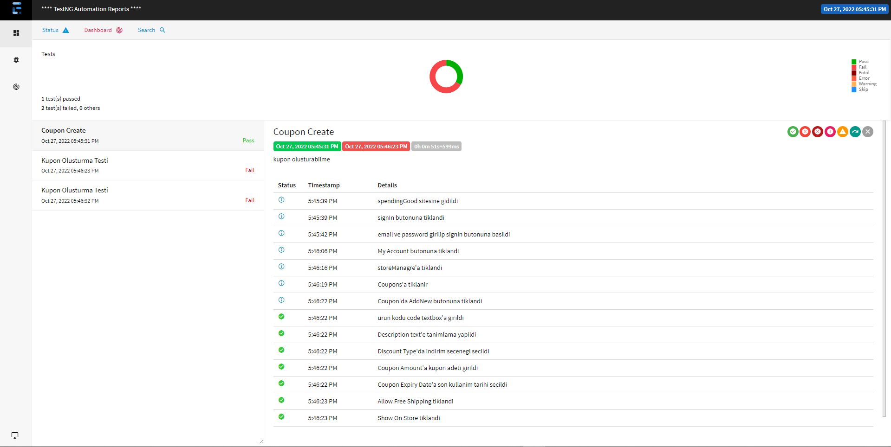

https://spendinggood.com/
sitesinin testlerini gerçekleştirdiğimiz bu projemizde Test NG framework ile çalışıldı.Test NG framework unde OOP(object oriented programming) konseptine uyarak POM(page object model) dizayn modeli kullanılmıştır

# page dosyasi

bu dosyamızda elimizde bulunan sitenin testlerini gerçekleştireceğimiz elementlerin locatelerini sakladığımız classlarımız bulunmakta.İstediğimiz locate leri almak için oluşturduğumuz classın adında constructar oluşturuyoruz ve içine PageFactory classını çağırıp içerisine oluşturduğumuz driver ı çağırıp burada olduğunu belli ettiğimiz this key kullanılır. locatelerimizinde çağırabilinmesi için de FindBy notasyonu ile locatelerimizi oluşturabiliriz

# test dosyasi

tests dosyamızda otomasyon kodlarimizi,test raporlarımızı ve failed olan kısımların ekran goruntulerinin alınacagı kodlarımızı  olusturulup run etmeye hazır hale getirdik.

# utilities dosyasi

yardımcı classımız bu dosyamızda bize sürekli lazım olan classlarımız ve methodlarımız bulunmaktadır. İçerisinde projemizi daha anlaşılır hale getirecek classlarımız ve methodlarımız vardır bunlar Driver.class , ConfigReader.class , ReusableMehod.class,TestBaseRapor vb. dosyalarımız bulunmaktadır.
## Configuration.properties

properties dosyamızda sürekli kullandığımız variablelarımız bulunmakta , bu veriable ları kullanmak için properties dosyası Key = value olarak oluşturulmakta ,buradaki bilgileri başka classlara çağırabilmek için utilities dosyasından ConfigReader classı çağrılır. içindeki method sayesınde bu dosyada bulunan bilgileri istediğimiz yerlere çağırabiliriz.

# pom.xml

tüm çalışmalarımızın ve kodlarımızın bilgilerinin bulunduğu bu dosyada aslında kullanmak istediğimiz kodların kütüphanesini dependencies tagının içerisine yerleştirip güncel bilgilerini sürekli olarak kendimizde tutabiliriz. burası sayesinde tüm kodlara erişimi sağlayabiliriz.

# Selenium Testi

 

Java18 ve Maven projesi oluşturulup Test NG framework kullanılarak oluşturulmuştur.

 

# Kullanilan Testler

E2E

SMOKE TEST

NEGATİVE SMOKE TEST

##  SPENDINGGOOD

